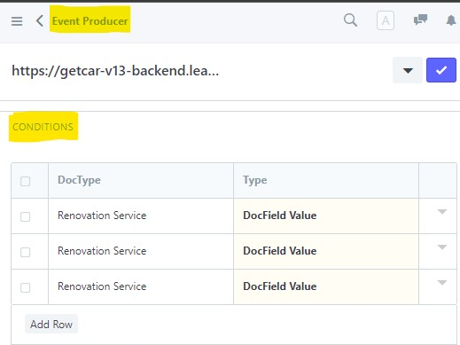
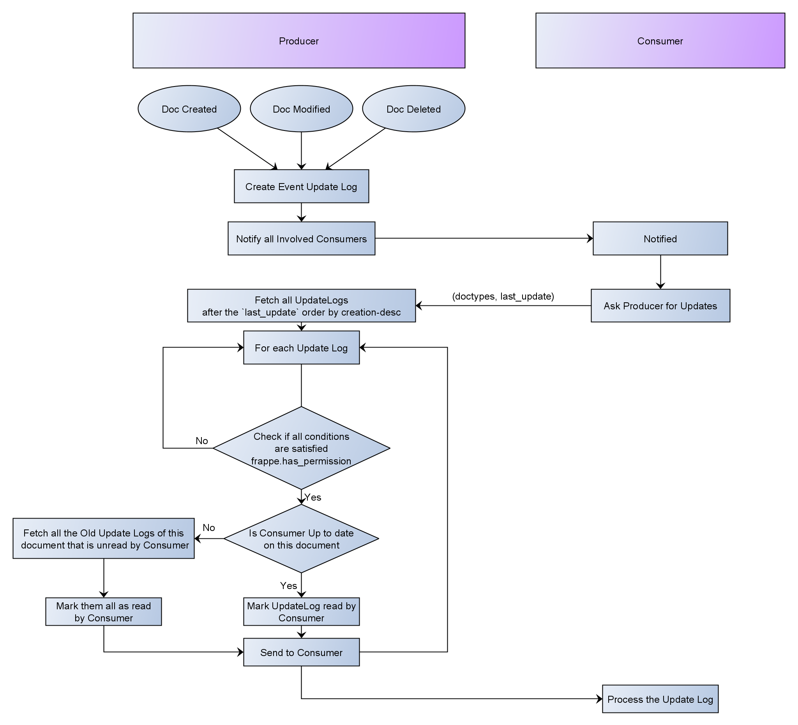

# Frappe Renovation Docsync

Frappe added EventStreaming module recently in their v13 release. This enables a site to subscribe to another site for all document updates.
This enables forwarding all the `Sales Invoices` made on one site to be reflected on another site. This is great!

But what if we dont want to send over all the `Sales Invoice`s ? What if you need to send only those invoices made by `Customer A` ?
Here we propose a solution for that.

While making a `Event Producer` document instance on the Consumer site, we specify the conditions along with it. This allows Consumer specific conditions.  

We can even set conditions on Global level using the `Event DocType Condition` doctype. It can be used to set a single condition for all Consumers.

## Implementation
This flowchart aims to provide a simple overview.

In order to get our customizations working with frappe's system, 3 frappe functions had to be patched. You can find them patched [here.](https://github.com/leam-tech/frappe_renovation_docsync/blob/21e72e1d74577241c16d58eb85fc128a1bdfb9c5/frappe_renovation_docsync/__init__.py#L11)
- [EventProducer.get_request_data](https://github.com/frappe/frappe/blob/e62ccbf93abfc9b8453a3b09a83edcbee9b87116/frappe/event_streaming/doctype/event_producer/event_producer.py#L66)  
This allows us to send the consumer specific `conditions` table entries over for the Producer to accept.
- [EventProducer.update_event_consumer](https://github.com/frappe/frappe/blob/e62ccbf93abfc9b8453a3b09a83edcbee9b87116/frappe/event_streaming/doctype/event_producer/event_producer.py#L93)  
This allows us to update the consumer specific `conditions` table entries over to the Producer
- [EventProducer.get_updates](https://github.com/frappe/frappe/blob/e62ccbf93abfc9b8453a3b09a83edcbee9b87116/frappe/event_streaming/doctype/event_producer/event_producer.py#L312)  
This allows us to filter/or be selective on what `Event Update Log` to send back to the Consumer

## License

MIT